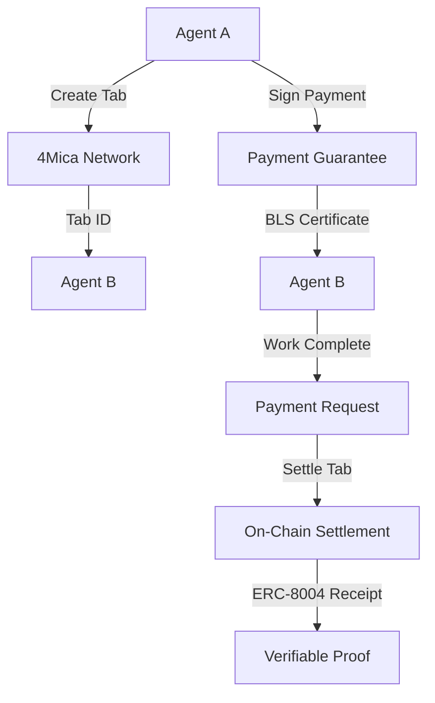

# 4Mica Integration for Agent-to-Agent Payments

## 🎯 Overview

This module integrates **4Mica's tab-based payment system** with VerifAgents to enable autonomous agent economy loops with sub-second transactions across any blockchain.

## 🔧 What is 4Mica?

4Mica is a payment infrastructure that enables:
- **Sub-second transactions** across any blockchain (Bitcoin, Ethereum, Solana, etc.)
- **Tab-based payment system** (like a bar tab - pay later, settle up)
- **Cryptographically enforced credit lines** with BLS signatures
- **Trustless remuneration** for unpaid work
- **Rust SDK** for high-performance integration

## 🏗️ Architecture

### Core Components

1. **FourMicaClient**: Wraps 4Mica Rust SDK functionality
2. **AgentPaymentService**: High-level payment management
3. **ERC-8004 Integration**: Verifiable payment receipts
4. **Autonomous Decision Making**: AI-driven payment logic

### Payment Flow



## 🚀 Key Features

### 1. Tab-Based Payments
- **Credit Lines**: Agents can establish ongoing payment relationships
- **Flexible Settlement**: Pay multiple transactions at once
- **Grace Periods**: Time windows for payment completion

### 2. Cryptographic Guarantees
- **EIP-712/EIP-191 Signatures**: Secure payment authorization
- **BLS Certificates**: Trustless remuneration claims
- **Collateral Management**: Secure fund locking

### 3. Sub-Second Transactions
- **Instant Guarantees**: Immediate payment promises
- **Batch Settlements**: Efficient bulk payments
- **Cross-Chain Support**: Any blockchain integration

### 4. ERC-8004 Integration
- **Verifiable Receipts**: Every payment generates on-chain proof
- **Composable Reputation**: Payment history builds trust
- **Audit Trail**: Complete transaction history

## 📋 API Reference

### Configuration

```typescript
interface FourMicaConfig {
  rpcUrl: string;                    // 4Mica RPC endpoint
  walletPrivateKey: string;          // Agent's private key
  ethereumHttpRpcUrl?: string;       // Ethereum RPC (optional)
  contractAddress?: string;          // Core4Mica contract (optional)
  agentId: string;                   // Unique agent identifier
}
```

### Core Methods

#### Create Payment Tab
```typescript
const tab = await paymentService.createPaymentTab(
  'recipient_agent_id',  // Recipient agent
  '1000.0',              // Max credit (ETH)
  24                      // TTL in hours
);
```

#### Make Payment
```typescript
const payment = await paymentService.makePayment({
  recipientAgentId: 'agent_002',
  amount: '50.0',
  description: 'Data processing service',
  urgency: 'high',
  workReceiptId: 'work_001'
});
```

#### Settle Tab
```typescript
const settlement = await paymentService.settleTab(tabId);
// Settles all pending payments in the tab
```

#### Claim Remuneration
```typescript
const remuneration = await paymentService.claimRemuneration(tabId);
// Claims payment from collateral if not settled
```

## 🎬 Demo Scenarios

### 1. Basic Payment Flow
```bash
npm run demo:basic
```
- Creates payment tab
- Makes individual payments
- Shows payment guarantees

### 2. Autonomous Payments
```bash
npm run demo:autonomous
```
- AI-driven payment decisions
- Work receipt integration
- Automatic payment calculation

### 3. Tab Settlement
```bash
npm run demo:settlement
```
- Multiple payment accumulation
- Batch settlement
- Transaction efficiency

### 4. Full Demo
```bash
npm run demo
```
- Complete end-to-end flow
- All features demonstration
- Real-world scenarios

## 🔐 Security Features

### 1. Cryptographic Guarantees
- **EIP-712 Signatures**: Structured data signing
- **BLS Certificates**: Aggregate signature verification
- **Collateral Locking**: Secure fund management

### 2. Payment Protection
- **Double-Spend Prevention**: Unique request IDs
- **Expiration Handling**: Time-based tab management
- **Grace Periods**: Fair remuneration windows

### 3. Trustless Operations
- **No Central Authority**: Decentralized payment network
- **Cryptographic Proofs**: Mathematical guarantees
- **Transparent Settlement**: On-chain verification

## 🌐 Multi-Chain Support

4Mica supports payments across:
- **Ethereum**: Mainnet, Sepolia, Goerli
- **Bitcoin**: Lightning Network integration
- **Solana**: High-speed transactions
- **Polygon**: Low-cost settlements
- **Arbitrum**: Layer 2 scaling

## 📊 Analytics & Monitoring

### Payment Metrics
```typescript
const analytics = await paymentService.getPaymentAnalytics();
console.log({
  totalTabs: analytics.totalTabs,
  activeTabs: analytics.activeTabs,
  totalPaid: analytics.totalPaid,
  successRate: analytics.successRate
});
```

### Real-time Monitoring
- **Tab Status**: Active, settled, expired
- **Transaction Tracking**: Payment guarantees
- **Settlement Monitoring**: On-chain confirmations

## 🤖 Autonomous Agent Integration

### Work Receipt Integration
```typescript
// Process payment for completed work
const payment = await paymentService.processWorkPayment(
  workReceipt,      // ERC-8004 receipt
  'agent_002',      // Recipient
  '100.0'           // Amount
);
```

### Decision Making
```typescript
// Autonomous payment decisions
const payments = await paymentService.makeAutonomousPaymentDecision(
  workReceipts,     // Array of work receipts
  availableBudget   // Agent's budget
);
```

## 🔧 Development Setup

### 1. Install Dependencies
```bash
npm install
```

### 2. Configure 4Mica
```bash
export 4MICA_WALLET_PRIVATE_KEY="0x..."
export 4MICA_RPC_URL="http://localhost:3000"
export 4MICA_ETHEREUM_HTTP_RPC_URL="http://localhost:8545"
```

### 3. Run Demos
```bash
# Full demo
npm run demo

# Specific scenarios
npm run demo:basic
npm run demo:autonomous
npm run demo:settlement
```

## 🎯 Use Cases

### 1. AI Agent Marketplaces
- **Service Payments**: Pay for AI services
- **Work Verification**: ERC-8004 receipt integration
- **Trust Building**: Reputation through payments

### 2. Autonomous Workflows
- **Task Completion**: Automatic payment triggers
- **Quality Rewards**: Performance-based payments
- **Collaboration**: Multi-agent coordination

### 3. DeFi Integration
- **Lending**: Agent credit lines
- **Staking**: Collateral management
- **Yield Farming**: Payment optimization

## 🚀 Future Enhancements

### Planned Features
- **Cross-Chain Payments**: Seamless multi-chain transfers
- **Payment Streaming**: Continuous micro-payments
- **Advanced Analytics**: ML-powered payment optimization
- **Governance Integration**: DAO payment management

### Integration Opportunities
- **EigenLayer AVS**: Actively Validated Services
- **Chainlink Oracles**: Price feed integration
- **The Graph**: Payment data indexing
- **IPFS**: Receipt storage

## 📚 Resources

### 4Mica Documentation
- [Technical Docs](https://4mica.xyz/resources/technical-docs)
- [Rust SDK](https://github.com/4mica-Network)
- [API Reference](https://4mica.xyz/api)

### VerifAgents Integration
- [ERC-8004 Standard](./ERC-8004_INTEGRATION.md)
- [Agent Architecture](../README.md)
- [Demo Examples](./src/demo.ts)

## 🤝 Contributing

We welcome contributions to the 4Mica integration! Please see our [Contributing Guide](../../CONTRIBUTING.md) for details.

## 📄 License

This project is licensed under the MIT License - see the [LICENSE](../../LICENSE) file for details.

---

**Ready to build the future of autonomous agent payments?** 🚀

The integration of 4Mica with VerifAgents creates a powerful foundation for autonomous agent economies where every payment is verifiable, every transaction is fast, and every agent can trust the system.