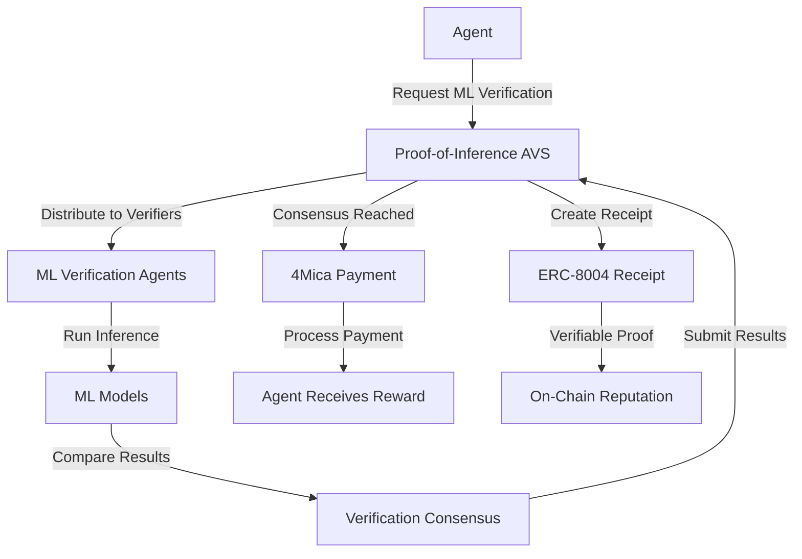

# 🧠 Proof-of-Inference Market - EigenLayer AVS for ML Verification

## 🎯 **Overview**

The Proof-of-Inference Market is an EigenLayer AVS (Actively Validated Service) that creates a decentralized marketplace for ML inference verification. It integrates with 4Mica payments and ERC-8004 receipts to enable autonomous agent ML verification with cryptographic guarantees.

## 🏗️ **Architecture**

### **Core Components**

1. **Proof-of-Inference AVS Contract** - EigenLayer AVS for ML verification
2. **ML Verification Agents** - Python agents that validate inference requests
3. **4Mica Payment Integration** - Autonomous payments for verification rewards
4. **ERC-8004 Receipts** - Verifiable proof of ML work
5. **Model Registry** - Decentralized model management and performance tracking

### **System Flow**



## 🔧 **Technical Implementation**

### **1. AVS Contract (`ProofOfInferenceAVS.sol`)**

```solidity
contract ProofOfInferenceAVS {
    struct InferenceRequest {
        address agent;
        string modelId;
        bytes inputData;
        bytes expectedOutput;
        uint256 reward;
        uint256 deadline;
        bool completed;
        bool verified;
        uint256 timestamp;
        bytes32 requestHash;
    }
    
    struct VerificationResult {
        address verifier;
        bool isValid;
        uint256 confidence;
        bytes proof;
        uint256 timestamp;
        uint256 gasUsed;
        string verificationMethod;
    }
}
```

**Key Functions:**
- `requestInferenceVerification()` - Submit ML inference for verification
- `submitVerification()` - Submit verification result from validators
- `registerModel()` - Register ML models for verification
- `getModelInfo()` - Get model performance statistics

### **2. ML Verification Agent (`ml_verification_agent.py`)**

```python
class MLVerificationAgent:
    async def verify_inference_request(self, request_id: int) -> VerificationResult:
        # Get request details from contract
        request_data = self._get_request_data(request_id)
        
        # Run ML verification using multiple methods
        verification_result = await self._verify_inference(
            model_id, input_data, expected_output
        )
        
        # Submit verification to contract
        await self._submit_verification(request_id, verification_result)
```

**Verification Methods:**
- **Exact Match** - Direct comparison of outputs
- **Similarity Threshold** - Cosine similarity with threshold
- **Statistical Analysis** - Multiple runs with confidence intervals
- **Cross-Validation** - Multiple model validation

### **3. 4Mica Payment Integration**

```typescript
class ProofOfInferenceService {
  async processVerificationPayment(requestId: number): Promise<void> {
    // Get request details
    const request = await this.getInferenceRequest(requestId);
    
    // Create payment to agent via 4Mica
    const paymentResult = await this.paymentService.makePayment({
      recipientAgentId: `agent_${request.agent}`,
      amount: request.reward,
      description: `ML inference verification reward`
    });
  }
}
```

## 🎬 **Demo Scenarios**

### **Scenario 1: Model Registration**
```javascript
// Register ML model for verification
await avs.registerModel('gpt-3.5-turbo', '0.01'); // 0.01 ETH fee
await avs.registerModel('claude-3-opus', '0.015');
await avs.registerModel('llama-2-70b', '0.008');
```

### **Scenario 2: Inference Verification Request**
```javascript
// Agent requests ML inference verification
const verificationRequest = await avs.requestInferenceVerification(
  'gpt-3.5-turbo',
  {
    prompt: "Explain quantum computing",
    max_tokens: 150,
    temperature: 0.7
  },
  {
    response: "Quantum computing uses qubits...",
    confidence: 0.95,
    tokens_used: 142
  },
  '0.1', // 0.1 ETH reward
  deadline
);
```

### **Scenario 3: Multi-Verifier Consensus**
```javascript
// Multiple verifiers validate the inference
for (const verifier of verifiers) {
  const result = await mlAgent.verifyInference(requestId);
  await avs.submitVerification(
    requestId,
    result.isValid,
    result.confidence,
    result.proof,
    result.method
  );
}
```

### **Scenario 4: Payment Processing**
```javascript
// AVS reaches consensus and processes payment
if (request.verified) {
  await fourMicaClient.payTab(
    tabId,
    requestId,
    request.reward,
    request.agent
  );
}
```

## 🚀 **Key Features**

### **1. Decentralized ML Verification**
- **No Central Authority** - Verification distributed across EigenLayer operators
- **Consensus Mechanism** - Multiple verifiers must agree on results
- **Cryptographic Proofs** - Each verification includes cryptographic proof

### **2. Autonomous Payments**
- **4Mica Integration** - Sub-second payments for verification rewards
- **Automatic Processing** - Payments processed automatically on successful verification
- **Tab-Based System** - Efficient payment batching for ongoing verification

### **3. Verifiable Proof**
- **ERC-8004 Receipts** - Every verification generates verifiable receipt
- **On-Chain Reputation** - Model and agent performance tracked on-chain
- **Audit Trail** - Complete history of all verifications

### **4. Model Performance Tracking**
- **Accuracy Metrics** - Track model performance over time
- **Usage Statistics** - Monitor model usage and success rates
- **Trust Scores** - Build reputation for models and agents

## 💡 **What This Enables**

### **For VerifAgents Module #8 - Agent-to-Agent Payments:**

1. **ML Work Verification** - Agents can verify their ML inference work
2. **Autonomous Payments** - Automatic payments for successful ML work
3. **Trustless Validation** - No need to trust central authorities
4. **Reputation Building** - Build on-chain reputation for ML capabilities
5. **Market Creation** - Create a market for ML verification services

### **For Autonomous Agent Economies:**

1. **ML Service Marketplace** - Agents can offer ML services with verification
2. **Quality Assurance** - Ensure ML work meets quality standards
3. **Payment Guarantees** - Cryptographic guarantees for ML work payments
4. **Scalable Verification** - Handle large-scale ML verification requests
5. **Cross-Chain Support** - Works across multiple blockchains

## 🔧 **Setup and Deployment**

### **1. Deploy AVS Contract**
```bash
# Deploy to your target network
forge script script/DeployProofOfInferenceAVS.s.sol:DeployProofOfInferenceAVS \
  --broadcast --rpc-url $RPC_URL --private-key $PRIVATE_KEY
```

### **2. Configure ML Verification Agents**
```python
config = {
    'rpc_url': 'https://your-rpc-url',
    'private_key': '0x...',
    'contract_address': '0x...',
    'models': [
        {
            'model_id': 'gpt-3.5-turbo',
            'model_type': 'huggingface',
            'model_path': 'microsoft/DialoGPT-medium',
            'verification_threshold': 0.95
        }
    ]
}

agent = MLVerificationAgent(config)
await agent.run_verification_loop()
```

### **3. Integrate with 4Mica**
```typescript
const proofOfInferenceService = new ProofOfInferenceService({
  avsAddress: '0x...',
  rpcUrl: 'https://your-rpc-url',
  privateKey: '0x...',
  agentId: 'ml_agent_001',
  fourMicaConfig: {
    rpcUrl: 'http://localhost:3000',
    walletPrivateKey: '0x...',
    agentId: 'ml_agent_001'
  }
});

await proofOfInferenceService.initialize();
```

## 📊 **Performance Metrics**

### **Verification Speed**
- **Sub-second consensus** - Fast verification using EigenLayer
- **Parallel processing** - Multiple verifiers work simultaneously
- **Efficient batching** - Batch multiple verifications together

### **Cost Efficiency**
- **4Mica payments** - Low-cost sub-second payments
- **Gas optimization** - Efficient contract design
- **Batched operations** - Reduce transaction costs

### **Scalability**
- **EigenLayer scaling** - Leverages EigenLayer's scaling capabilities
- **Model diversity** - Support for any ML model type
- **Cross-chain support** - Works across multiple blockchains

## 🎯 **Use Cases**

### **1. AI Agent ML Work Verification**
- Agents submit ML inference work for verification
- Multiple verifiers validate the work
- Successful verification triggers automatic payment

### **2. ML Model Performance Tracking**
- Track model accuracy over time
- Build reputation for high-quality models
- Enable model selection based on performance

### **3. Decentralized ML Marketplace**
- Create market for ML verification services
- Enable trustless ML work validation
- Build autonomous ML agent economies

### **4. Research and Development**
- Verify ML research results
- Track model improvements
- Enable collaborative ML development

## 🔮 **Future Enhancements**

### **1. Advanced Verification Methods**
- **Zero-Knowledge Proofs** - Privacy-preserving verification
- **Federated Learning** - Distributed model training verification
- **Adversarial Testing** - Robustness verification

### **2. Cross-Chain Integration**
- **Multi-chain support** - Work across different blockchains
- **Cross-chain payments** - Seamless payment across chains
- **Universal verification** - Verify work from any chain

### **3. Advanced ML Features**
- **Model versioning** - Track model updates and improvements
- **A/B testing** - Compare different model versions
- **Performance analytics** - Detailed performance metrics

## 🎬 **Demo Recording**

Run the complete demo:
```bash
cd modules/agent-payments
node proof-of-inference-demo.js
```

**Key moments to highlight:**
- **0:00-1:00**: Model registration and setup
- **1:00-2:00**: Inference verification request
- **2:00-3:00**: Multi-verifier consensus process
- **3:00-4:00**: 4Mica payment processing
- **4:00-5:00**: Performance tracking and reputation building

This creates a complete autonomous ML verification market that enables AI agents to verify their work and get paid automatically! 🚀